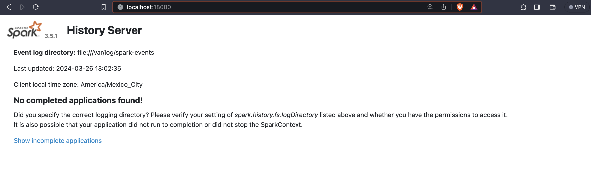

# Spark Cluster with Docker & docker-compose(2021 ver.)

# General

A simple spark standalone cluster for your testing environment purposes. A *docker-compose up* away from you solution
for your spark development environment.

The Docker compose will create the following containers:

| container            | Exposed ports |
|----------------------|---------------|
| spark-history-server | 18080         |
| spark-master         | 9090 7077     |
| spark-worker-1       | 9091          |
| spark-worker-2       | 9092          |
| demo-database        | 5432          |

# Installation

The following steps will make you run your spark cluster's containers.

## Pre requisites

* Docker installed

* Docker compose installed

## Build the image

```sh
docker build -t cluster-apache-spark:3.5.1 .
```

## Tag the image

```sh
docker tag cluster-apache-spark:3.5.1 cluster-apache-spark:latest
```

## Run the docker-compose

The final step to create your test cluster will be to run the compose file:

```sh
docker-compose up -d
```

## Validate your cluster

Just validate your cluster accessing the spark UI on each worker & master URL.

### Spark History Server

http://localhost:18080/



### Spark Master

http://localhost:9090/


### Spark Worker 1

http://localhost:9091/


### Spark Worker 2

http://localhost:9092/


# Resource Allocation

This cluster is shipped with three workers and one spark master, each of these has a particular set of resource
allocation(basically RAM & cpu cores allocation).

* The default CPU cores allocation for each spark worker is 1 core.

* The default RAM for each spark-worker is 1024 MB.

* The default RAM allocation for spark executors is 256mb.

* The default RAM allocation for spark driver is 128mb

* If you wish to modify these allocations just edit the env/spark-worker.sh file.

# Bound Volumes

To make app running easier I've shipped two volume mounts described in the following chart:

| Host Mount | Container Mount | Purpose                                                        |
|------------|-----------------|----------------------------------------------------------------|
| apps       | /opt/spark-apps | Used to make available your app's jars on all workers & master |
| data       | /opt/spark-data | Used to make available your app's data on all workers & master |

This is basically a dummy DFS created from docker Volumes...(maybe not...)

# Configuration

You can set default properties for `spark-submit` inside `conf/spark-defaults.conf`. Here we define the properties
required to run the Spark History Server:

* `spark.eventLog.enabled` -> `true`
* `spark.eventLog.dir` -> `file:///var/log/spark-events`
* `spark.history.fs.logDirectory` -> `file:///var/log/spark-events`

# Run Sample applications

The demo applications use the top spotify songs dataset from
kaggle ([download here](https://www.kaggle.com/datasets/arnavvvvv/spotify-music/code)).

## Pyspark

[Full reference](./apps/pyspark_demo/README.md).

[pyspark demo](./articles/images/pyspark-demo.png)

## Scala

[Full reference](./apps/scalademo/README.md).

[scala demo](./articles/images/scala-demo.png)

# Summary

* We compiled the necessary docker image to run spark master and worker containers.

* We created a spark standalone cluster using 2 worker nodes and 1 master node using docker && docker-compose.

* Copied the resources necessary to run demo applications.

* We ran a distributed application at home(just need enough cpu cores and RAM to do so).

* Updated python version to 3.11.8 and Open JDK 21.

* Added Spark History Server to see previously executed applications.

# Why a standalone cluster?

* This is intended to be used for test purposes, basically a way of running distributed spark apps on your laptop or
  desktop.

* This will be useful to use CI/CD pipelines for your spark apps(A really difficult and hot topic)

# Steps to connect and use a pyspark shell interactively

* Follow the steps to run the docker-compose file. You can scale this down if needed to 1 worker.

```sh
docker-compose up --scale spark-worker=1
docker exec -it docker-spark-cluster_spark-worker_1 bash
apt update
apt install python3-pip
pip3 install pyspark
pyspark
```

# What's left to do?

* Right now to run applications in deploy-mode cluster is necessary to specify arbitrary driver port.

* The spark submit entry in the start-spark.sh is unimplemented, the submit used in the demos can be triggered from any
  worker